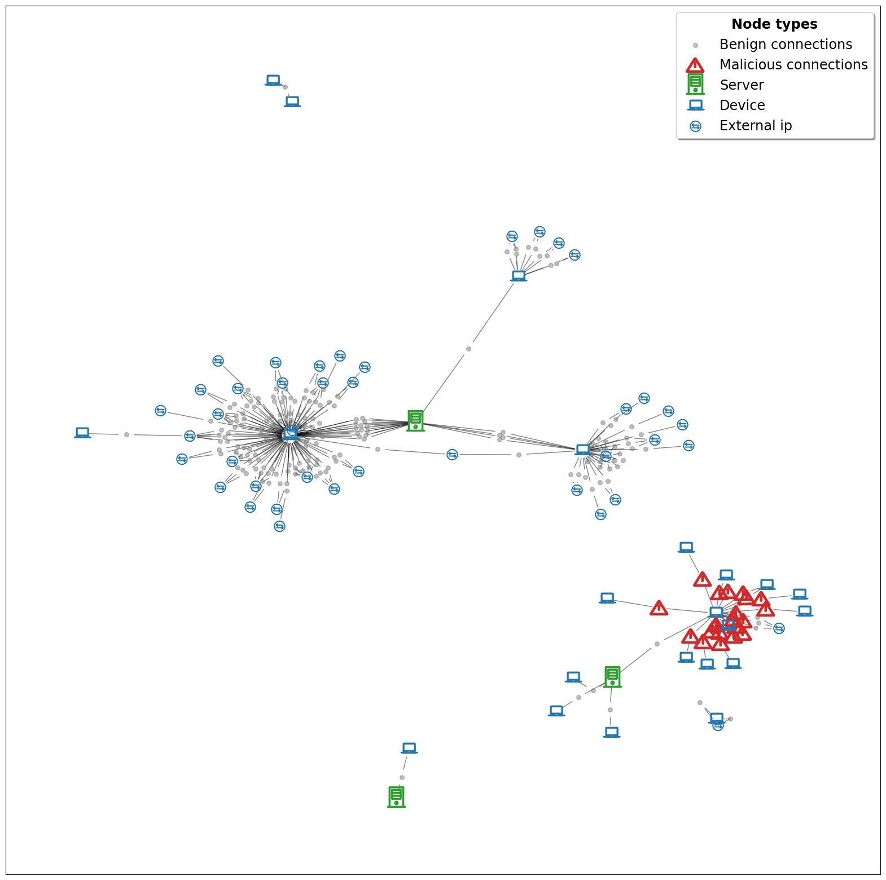
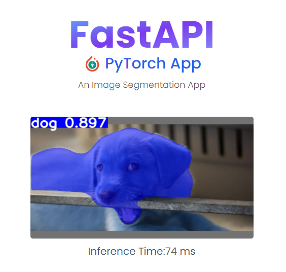

# Overview

**Graph based modeling for intelligent monitoring**
[link :link:](https://github.com/aaronfderybel/graph-based-intrusion-detection)

Detecting malicious actions on a computer network with the use of artificial intelligence is called intelligent monitoring.
Data can be represented in a graph structure, consisting of nodes connected by edges. 
Graphs are valid representations of information containing some inherent netwerk-type structure such as social networks, molecules and of course computer networks.

* Implemented a custom graph structure.
* Experimentation through command line.
* Visualisations of the graph and predictions on nodes.

**Instance segmentation web app** [link :link:](https://github.com/aaronfderybel/instance-segmentation-web-app)

A simple local run web-app to perform instance segmenetation on pictures.
* Uses YOLOv7 algorithm for fast detection.
* fastAPI for model deployment.

